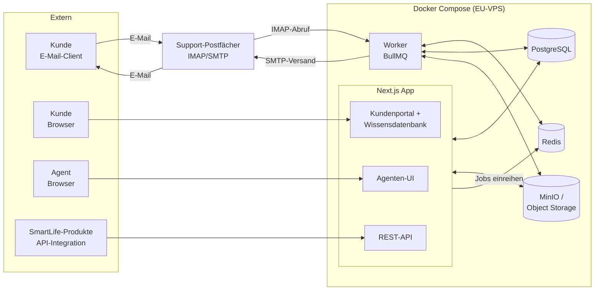
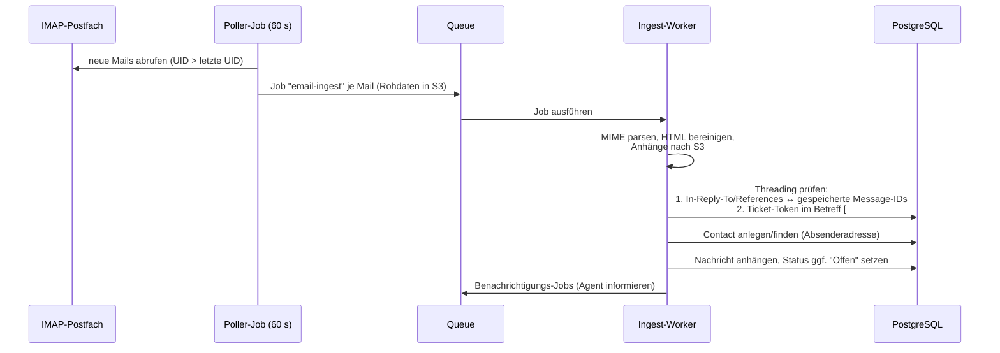

# 02 — Architektur & Technologie-Stack

## 1. Stack-Entscheidung

**Empfehlung: TypeScript-Fullstack** — eine Sprache über Frontend, Backend und Hintergrundjobs, großes Ökosystem, gut wartbar auch mit kleinem Team.

| Baustein | Technologie | Begründung |
|---|---|---|
| Web-App (Agenten-UI + Kundenportal) | **Next.js 15 (App Router) + React + TypeScript** | SSR fürs Portal (SEO für Wissensdatenbank), eine Codebasis für beide Oberflächen |
| UI-Komponenten | **Tailwind CSS + shadcn/ui** | Schnelle, konsistente UI ohne Design-Overhead |
| API | **Next.js Route Handlers (REST)** | Kein separater API-Server nötig; öffentliche REST-API fällt mit ab (siehe Dokument 04) |
| Datenbank | **PostgreSQL 16** | Relationale Integrität, Volltextsuche (`tsvector`), JSONB für Custom Fields |
| ORM | **Prisma** | Typsichere Queries, Migrationen im Repo |
| Jobs & Queues | **BullMQ + Redis** | E-Mail-Abruf, E-Mail-Versand, SLA-Uhren, zeitgesteuerte Regeln |
| E-Mail eingehend | **IMAP-Poller (`imapflow`) oder Inbound-Webhook** (Postmark/Mailgun) | IMAP funktioniert mit jedem bestehenden Postfach (auch M365); Webhook-Variante als Alternative ohne Polling |
| E-Mail ausgehend | **SMTP (`nodemailer`)** | Versand über bestehendes Postfach oder Transaktionsdienst; DKIM/SPF beachten |
| E-Mail-Parsing | **`mailparser` + `sanitize-html`** | MIME, Anhänge, Inline-Bilder; HTML wird vor Anzeige bereinigt |
| Datei-Speicher | **S3-kompatibel (MinIO self-hosted oder Hetzner Object Storage)** | Anhänge nicht in der DB; Zugriff über kurzlebige signierte URLs |
| Authentifizierung | **Auth.js (NextAuth)** — Agenten optional via Microsoft Entra ID (M365-SSO), Kunden via E-Mail/Passwort oder Magic-Link | SmartLife nutzt M365 → SSO für Agenten ohne extra Passwortverwaltung |
| Deployment | **Docker Compose** auf EU-VPS (z. B. Hetzner) | Ein Server genügt; Compose-Datei = reproduzierbare Umgebung |
| Monitoring | **Sentry (self-hosted o. EU) + Healthchecks** | Fehler-Tracking, Job-Überwachung |

> **Alternative .NET:** Falls das Team primär C#/.NET entwickelt, ist ASP.NET Core + EF Core + Blazor/React gleichwertig tragfähig. Datenmodell (Dokument 03) und API (Dokument 04) sind stack-neutral formuliert und gelten unverändert.

## 2. Systemübersicht



**Zwei Prozesse, ein Codebase-Repo:**

1. **`web`** — Next.js-App: Agenten-UI (`/app`), Kundenportal (`/portal`), Wissensdatenbank (`/kb`), REST-API (`/api/v1`)
2. **`worker`** — Node-Prozess mit BullMQ-Workern für alles Asynchrone

## 3. E-Mail-Pipeline (Herzstück des Systems)

### Eingehend



Wichtige Details:

- **Idempotenz:** `Message-ID` der Mail wird unique gespeichert — doppelter Abruf erzeugt kein Duplikat.
- **Loop-Schutz:** Auto-Reply-Erkennung (`Auto-Submitted`, `X-Autoreply`, Precedence-Header) → keine Auto-Antwort auf Auto-Antworten; Absender = eigene Postfachadresse wird verworfen.
- **Rohdaten-Aufbewahrung:** Original-EML 90 Tage in S3 — erlaubt Re-Processing bei Parser-Fehlern.
- **Bounce-Handling:** Unzustellbarkeits-Mails werden erkannt und am Ticket vermerkt statt als Kundenantwort einsortiert.

### Ausgehend

- Agentenantwort → Job `email-send` → SMTP-Versand mit:
  - `In-Reply-To`/`References` auf die letzte Kunden-Message-ID (Threading beim Kunden),
  - Betreff `Re: <Originalbetreff> [#<ticketnr>-<token>]` (Fallback-Threading),
  - versendete `Message-ID` wird am Ticket gespeichert (für Threading eingehender Antworten).
- Fehlversand → Retry mit Backoff (3×), danach Markierung an der Nachricht + Hinweis im UI.

## 4. Modul-Schnitt (Backend)

```
src/
├── modules/
│   ├── tickets/        # Ticket-CRUD, Statuslogik, Zuweisung, Merge
│   ├── conversations/  # Nachrichten, interne Notizen, Anhänge
│   ├── contacts/       # Kunden & Organisationen
│   ├── mail/           # IMAP-Poller, Parser, Threading, SMTP-Versand
│   ├── notifications/  # E-Mail-Benachrichtigungen (Templates)
│   ├── kb/             # Wissensdatenbank (P2)
│   ├── sla/            # SLA-Richtlinien, Uhren, Eskalation (P3)
│   ├── automation/     # Regeln & Makros (P3)
│   ├── reporting/      # Kennzahlen, Aggregationen (P2/P3)
│   └── auth/           # Sessions, Rollen, Portal- vs. Agenten-Login
├── jobs/               # BullMQ-Worker-Definitionen
└── lib/                # DB-Client, S3-Client, Mailer, Konfiguration
```

Regeln:

- Module kommunizieren über explizite Service-Funktionen, nicht über direkte DB-Zugriffe in fremde Tabellen.
- Jede Ticket-Änderung läuft durch den `tickets`-Service → dort entstehen Audit-Log-Einträge und Domain-Events (z. B. `ticket.replied`), auf die Benachrichtigungen/Automatisierung/SLA reagieren. Das hält P3-Funktionen andockbar, ohne das MVP zu verkomplizieren.

## 5. Sicherheit & DSGVO

- **Serverstandort EU**, Anhänge und DB verschlüsselt at rest (Volume-Verschlüsselung)
- **Portal-Isolation:** Kunden-Sessions und Agenten-Sessions sind getrennte Auth-Kontexte; jede Portal-Query filtert serverseitig auf `contact_id`/`organization_id`
- **HTML-Mails** werden serverseitig sanitisiert und in einer sandboxed iframe ohne externes Nachladen gerendert (Tracking-Pixel-Schutz)
- **Löschkonzept:** Kontakt anonymisieren (Name/E-Mail → Platzhalter, Nachrichteninhalte optional schwärzen) statt harter Löschung → Ticketstatistik bleibt konsistent
- **Backups:** täglicher `pg_dump` + S3-Sync, 30 Tage Aufbewahrung, monatlicher Restore-Test

## 6. Deployment

```yaml
# docker-compose.yml (Skizze)
services:
  web:     # Next.js (UI + API)
  worker:  # BullMQ-Worker (Mail, Jobs)
  db:      # postgres:16
  redis:   # redis:7
  minio:   # Anhänge (alternativ: Hetzner Object Storage)
  caddy:   # Reverse Proxy + automatisches TLS
```

- **Domains:** `support.smartlife.software` (Portal + KB, öffentlich), `desk.smartlife.software` (Agenten-UI, optional IP-beschränkt/VPN)
- **CI/CD:** GitHub Actions → Docker-Image bauen → per SSH deployen; Prisma-Migrationen laufen beim Start
- **Staging:** identisches Compose-Setup mit Test-Postfach
