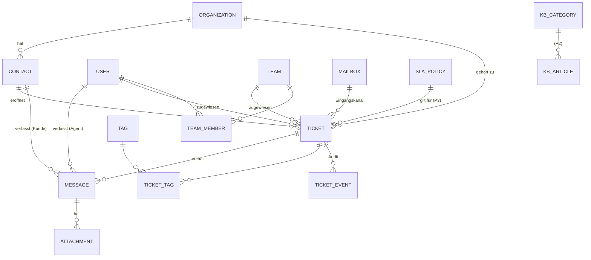

# 03 — Datenmodell

Vollständiges relationales Modell für alle Ausbaustufen. MVP-Tabellen sind markiert; spätere Tabellen (P2/P3) sind bereits mitentworfen, damit keine Umbau-Migrationen nötig werden. Das SQL-Schema (PostgreSQL) liegt in [`schema.sql`](schema.sql) und ist die maßgebliche Referenz.

## ER-Übersicht (Kern)

## Tabellen im Überblick

### Benutzer & Kunden

| Tabelle | Stufe | Zweck / wichtige Felder |
|---|---|---|
| `users` | MVP | Agenten/Admins. `email`, `name`, `role` (`agent`·`team_lead`·`admin`), `password_hash` (null bei SSO), `is_active` |
| `teams` | MVP | Support-Teams. `name`, `email_signature` |
| `team_members` | MVP | n:m `users`↔`teams` |
| `organizations` | MVP | Kundenfirmen. `name`, `domains[]` (Auto-Zuordnung neuer Kontakte per E-Mail-Domain), `portal_shared_tickets` (P2) |
| `contacts` | MVP | Endkunden. `email` (unique), `name`, `organization_id`, `portal_password_hash` (P2), `is_blocked` (Spam) |

### Ticketing

| Tabelle | Stufe | Zweck / wichtige Felder |
|---|---|---|
| `mailboxes` | MVP | Support-Postfächer. `address`, IMAP/SMTP-Zugang (Secrets via ENV-Referenz, nicht im Klartext), `default_team_id`, `last_seen_uid` |
| `tickets` | MVP | `number` (fortlaufend, für Kunden sichtbar), `subject`, `status`, `priority`, `channel` (`email`·`portal`·`api`·`manual`), `contact_id`, `organization_id`, `assignee_id`, `team_id`, `mailbox_id`, `category_id`, `first_replied_at`, `resolved_at`, `closed_at`, `custom_fields JSONB` (P2), SLA-Fristen (P3: `first_response_due_at`, `resolution_due_at`, `sla_paused_at`) |
| `ticket_categories` | MVP | Flache Kategorieliste (`Bug`, `Frage`, `Abrechnung`, …) |
| `messages` | MVP | Ticket-Nachrichten. `type` (`customer`·`agent_reply`·`internal_note`·`system`), Autor-Referenz (`user_id` **oder** `contact_id`), `body_html` (sanitisiert), `body_text`, E-Mail-Metadaten (`email_message_id` unique, `in_reply_to`, `raw_eml_key`), `send_status` (`pending`·`sent`·`failed`) für ausgehende |
| `attachments` | MVP | `message_id`, `file_name`, `content_type`, `size_bytes`, `storage_key` (S3), `is_inline` |
| `tags` / `ticket_tags` | MVP | Freie Schlagworte, n:m |
| `ticket_events` | MVP | Audit-Log. `event_type` (`created`·`status_changed`·`assigned`·`priority_changed`·`merged`·…), `actor_user_id`/`actor_contact_id`, `payload JSONB` (alt→neu) |
| `canned_responses` | MVP | Textbausteine. `title`, `body`, `team_id` (null = global), Platzhalter-Syntax `{{…}}` |
| `saved_views` | P2 | Gespeicherte Filteransichten je Agent/Team. `filter JSONB` |
| `custom_field_definitions` | P2 | Feld-Definitionen (`entity`, `key`, `label`, `type`, `options`), Werte liegen in `tickets.custom_fields` |

### Wissensdatenbank (P2)

| Tabelle | Zweck |
|---|---|
| `kb_categories` | Hierarchie via `parent_id`, `sort_order` |
| `kb_articles` | `title`, `slug`, `body_markdown`, `status` (`draft`·`published`·`archived`), `visibility` (`public`·`customers`·`internal`), `author_id`, `published_at`, `search_vector tsvector` |
| `kb_article_feedback` | P3 — hilfreich ja/nein + optionaler Kommentar |

### SLA & Automatisierung (P3)

| Tabelle | Zweck |
|---|---|
| `business_hours` | Kalender: Wochentage + Zeitfenster, `holidays date[]` |
| `sla_policies` | `conditions JSONB` (Priorität/Org/Kategorie), Ziele in Minuten je Priorität, `business_hours_id` |
| `sla_events` | Erreicht/verletzt-Protokoll je Ticket und Ziel (Grundlage fürs Reporting) |
| `automation_rules` | `trigger` (`ticket_created`·`ticket_updated`·`time_based`), `conditions JSONB`, `actions JSONB`, `position` (Reihenfolge), `is_active` |
| `csat_surveys` | Bewertung 1–5 + Kommentar, Token-basierter Zugriff aus der Lösungs-Mail |
| `webhooks` | `url`, `events[]`, `secret` (Signatur), Fehlerzähler |

## Zentrale Entwurfsentscheidungen

1. **`messages.type` statt separater Notiz-Tabelle** — interne Notizen und Kundenantworten teilen 90 % der Struktur; das `type`-Feld hält Abfragen ("kompletter Verlauf") trivial. Sichtbarkeit fürs Portal: `type != 'internal_note' AND type != 'system'`.
2. **E-Mail-Threading über drei Stufen** — `in_reply_to`/`references` gegen gespeicherte `email_message_id`s, dann Ticket-Token im Betreff, dann neues Ticket. Alle versendeten Message-IDs werden gespeichert, damit Kundenantworten auf jede Systemmail zuordenbar sind.
3. **`ticket_events` von Tag 1** — das Audit-Log ist nachträglich nicht rekonstruierbar; außerdem speist es später SLA-Berechnung (Erstreaktion = erstes `agent_reply`) und Reporting, ohne dass Tickets zusätzliche Zähler brauchen.
4. **`custom_fields` als JSONB + Definitionstabelle** — flexibel ohne Migrationen; Validierung erfolgt in der Anwendungsschicht gegen `custom_field_definitions`. GIN-Index für Filterbarkeit.
5. **Ticketnummern über Postgres-`SEQUENCE`** — garantiert lückenarm fortlaufend und kollisionsfrei, unabhängig von UUID-Primärschlüsseln (intern UUIDv7 für Sortierbarkeit).
6. **Anonymisierung statt Löschung** — `contacts.anonymized_at`; Name/E-Mail werden überschrieben, Tickets bleiben für Statistik erhalten (DSGVO Art. 17 via Anonymisierung erfüllt).
7. **Volltextsuche** — generierte `tsvector`-Spalten auf `tickets.subject` + `messages.body_text` und `kb_articles`, deutsche + englische Konfiguration kombiniert; kein externer Suchserver nötig.

## Indizes (Auszug, vollständig in schema.sql)

- `tickets (status, team_id, updated_at DESC)` — Standard-Eingangsansicht
- `tickets (assignee_id, status)` — "Meine Tickets"
- `messages (ticket_id, created_at)` — Verlauf
- `messages (email_message_id) UNIQUE` — Idempotenz + Threading
- `contacts (lower(email)) UNIQUE` — Absender-Zuordnung
- GIN auf `search_vector`-Spalten und `tickets.custom_fields`
